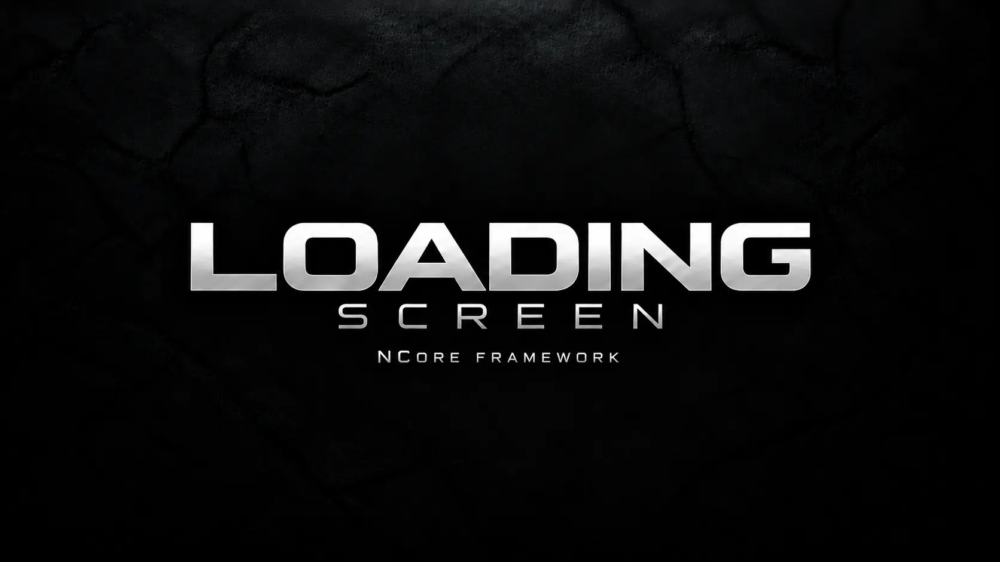

# NCore Framework — Official Branding

This page contains public branding materials explicitly approved for presentation by NCore Framework.

## NCore Framework

  

## NCore Control

  

## NCore Loading Screen

  

**Français :** ce visuel est l'identité visuelle officielle approuvée de NCore Loading Screen. Sa présence ici ne signifie pas que le package, son code ou une release publique est disponible.

**English:** this artwork is the approved official visual identity of NCore Loading Screen. Its presence here does not mean that the package, its code or a public release is available.

---

Copyright © 2026 Gosse Nicolas (Boubeur). All Rights Reserved.
