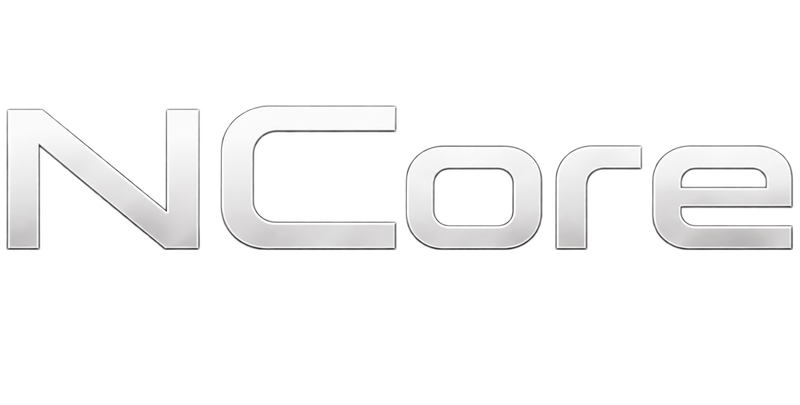
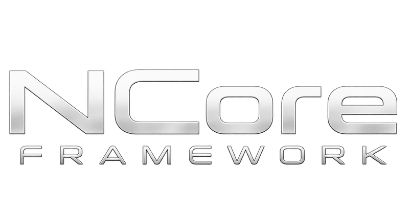
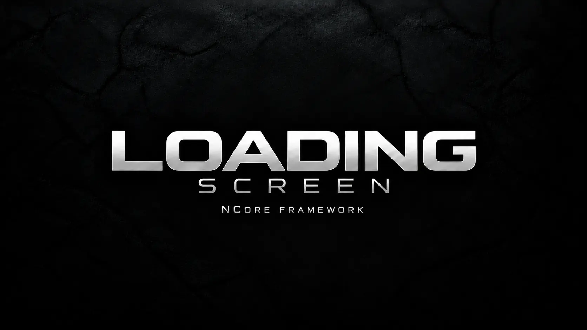

# NCore Framework — Official Branding

This page contains public branding materials explicitly approved for presentation by NCore Framework.

The two logotypes below are the canonical public-safe NCore identities approved on **2026-10-06**. Their lettering, spacing, proportions, composition and metallic treatment are immutable.

The dark/black background used in source presentation artwork is **not part of the logo**. The approved Git distribution assets below use transparency and are uniform-scaled derivatives of the validated masters.

## NCore

  

**Usage:** short NCore brand signature for products, interfaces, inventory assets and contexts where the NCore identity is already explicit.

**Public Git asset SHA-256:** `005b3fe74ec7e1e8c330e3ae013de497d35eb6fad3f53202155ad5a9bfd233ee`

## NCore Framework

  

**Usage:** full signature for NCore Framework itself, framework presentation pages and official framework documentation.

**Public Git asset SHA-256:** `85a954d775ad4c215be8db1eb0aab1ff4f155e09c889be4400e8550027e0b4b6`

## Integrity and usage rules

Allowed:
- uniform scaling;
- positioning;
- compositing the unchanged official asset over another visual.

Not allowed:
- redraw or recreation;
- AI/image-generation reinterpretation;
- typography, spacing or proportion changes;
- recoloring;
- stretching or distortion;
- adding a symbol, monogram or alternate mark;
- modifying one official variant to manufacture another.

For branded NCore inventory images, the official logo asset must be composited unchanged. It must never be regenerated as part of the item image.

## NCore Control

  

## NCore Loading Screen

  

**Français :** ce visuel est l'identité visuelle officielle approuvée de NCore Loading Screen. Sa présence ici ne signifie pas que le package, son code ou une release publique est disponible.

**English:** this artwork is the approved official visual identity of NCore Loading Screen. Its presence here does not mean that the package, its code or a public release is available.

---

Copyright © 2026 Gosse Nicolas (Boubeur). All Rights Reserved.
