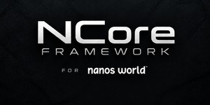

  

<h1 align="center">NCore Framework</h1>

  <strong>Framework RP modulaire et outils officiels pour NANOS / nanos world.</strong> 
  Modular RP framework and official tools for NANOS / nanos world.

## Directory

- **[NCore Control](https://github.com/ncore-framework-official/ncore-control)** — application Windows officielle de gestion de serveurs NANOS / nanos world.
- **[NCore Loading Screen](https://github.com/ncore-framework-official/ncore-loading-screen)** — écran de chargement officiel NCore.
- **[NCore Control Releases](https://github.com/ncore-framework-official/ncore-control/releases)** — téléchargements publics officiels.
- **[Branding](https://github.com/ncore-framework-official/.github/blob/main/BRANDING.md)** — identités visuelles publiques officielles.
- **[Support](https://github.com/ncore-framework-official/.github/blob/main/SUPPORT.md)** — règles et canaux de support public.

> Les dépôts publics NCore apparaissent dans l'organisation uniquement après validation explicite de leur publication.

## Our Socials!

  
  
  

